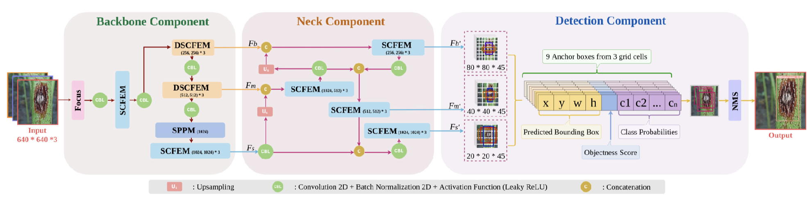
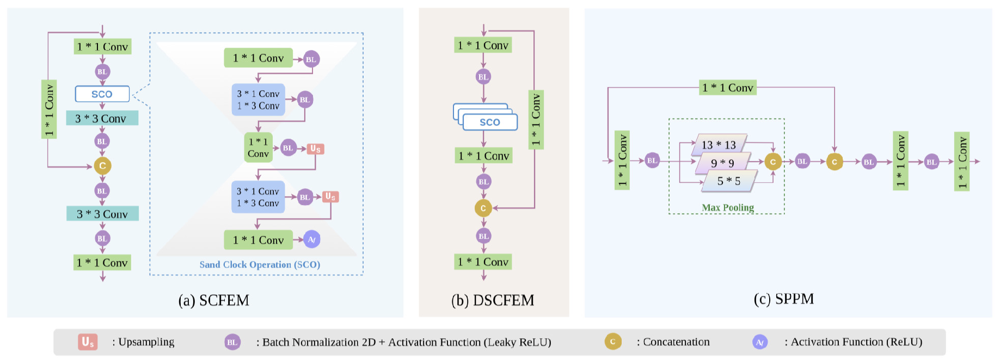
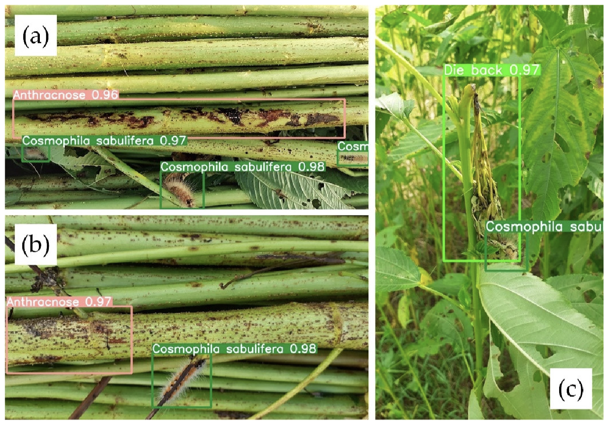
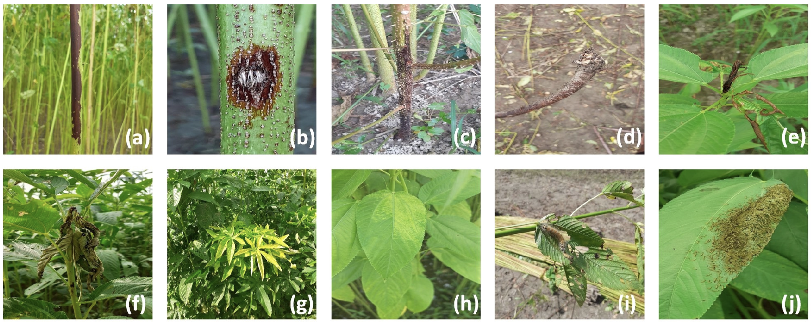

# YOLO-JD<br>
This repos contains the official codes for papers:<br>
<br>
**YOLO-JD: A Deep Learning Network for Jute Diseases and Pests Detection from Images**<br>
[D. Li†](https://davidleepp.github.io/), F. Ahmed†, N. Wu*, and A.I. Sethi<br>
<ins>†</ins> *Equal contribution*<br>
Pubilshed on *Plants* in 2022<br>
[[Paper](https://www.mdpi.com/2223-7747/11/7/937)]<br>
<br>

## Prerequisites<br>
The code written in pytorch, and their corresponding configurations are as follows:
* All deep networks run under Ubuntu 18.04
  * Python >=3.7
  * Pytorch >=1.8.0 

## Introduction<br>

Plant diseases and pests are a global threat to crop yields, and they may be even more destructive for smallholder farmers whose livelihoods depend heavily on healthy harvests.  In this scenario, early and precise detection of plant diseases and pests is critical for avoiding losses in agricultural production. Recently, disease prevention in jute plants has become an urgent topic as a result of the growing demand for finer quality fiber.<br><br>
This research presents a deep-learning network called YOLO-JD for detecting jute diseases from images. In the main architecture of YOLO-JD, we integrated three new modules such as Sand Clock Feature Extraction Module (SCFEM), Deep Sand ClockFeature Extraction Module (DSCFEM), and Spatial Pyramid Pooling Module (SPPM) to extract image features effectively. We also built a new large-scale image dataset for jute diseases and pests with ten classes.<br>
***<p align="center">Architecture of YOLO-JD***<br><br>
<br><br>
***<p align="center">The detailed demonstration of several key modules in YOLO-JD***<br><br>
<br><br>
***<p align="center">YOLO-JD detection on images that have multiple instances of the same disease and that have multiple classes of diseases and pests on the same image***<br><br>
<br><br>

## Quick Start<br>

```bash
git clone https://github.com/foysalahmed10/YOLO-JD.git # clone
cd YOLO-JD-master
pip install -r requirements.txt  # install
```


## Original_Dataset<br>
The images of jute diseases and pests were collected in Jamalpur and Narail districts in Bangladesh in July 2021. To diversify the dataset, the images were captured over the course of a single day under both sunny and cloudy weather. The images were captured by a Canon Powershot G16 camera and the camera of a Samsung Galaxy S10 with different viewing angles and different distances (0.3–0.5 m). In total, 4418 images in multiple jute disease and pest classes were obtained. The light intensity and background circumstances of the images vary greatly in the dataset. Though the image sizes are not uniform in our dataset, we prepare a normalization step at the beginning of the network to unify all images to a fixed resolution of 640 × 640. Eight common diseases including stem rot, anthracnose, black band, soft rot, tip blight, dieback, jute mosaic, and jute chlorosis, as well as two pests—Jute Hairy Caterpillar, and Comophila sabulifers—are incorporated into our dataset.<br><br>
***<p align="center">Some sample images from our jute diseases and pests dataset***<br><br>
<br><br>

### Data_preprocessing<br>
Raw data needs to be preprocessed before it can be fed into networks for training or testing. First, we apply image pre-processing methods such as brightness correction and image filtering on sample images to enhance the quality of the dataset. Then, an annotation software called ‘LabelImg’ was used to draw the ground truth bounding boxes of the disease or pests in all images. Visit this link to download the LabelImg: https://github.com/HumanSignal/labelImg <be>

### Data_Download<br>
Visit this link to download the dataset: https://1drv.ms/u/s!Al1NYDOSIj467ysFMpzJWJc7fEtc?e=FIU6bX

## Acknowledgement
Part of our code was descended and modified from the open-source code by ultralytics. Their original code can be found at: [https://github.com/ultralytics/yolov5.git].


## Citation<br>
Please consider citing our papers if the project helps your research with the following BibTex:
```
@article{li2022plantnet,
  title={YOLO-JD: A Deep Learning Network for Jute Diseases and Pests Detection from Images},
  author={Li, Dawei and Ahmed, Foysal and Wu, Nailong and Sethi, A.Ishrat},
  journal={Plants},
  volume={11(7)},
  pages={937},
  year={2022},
  publisher={MDPI}
  issn = {2223-7747},
  doi = {https://doi.org/10.3390/plants11070937}
}
```
